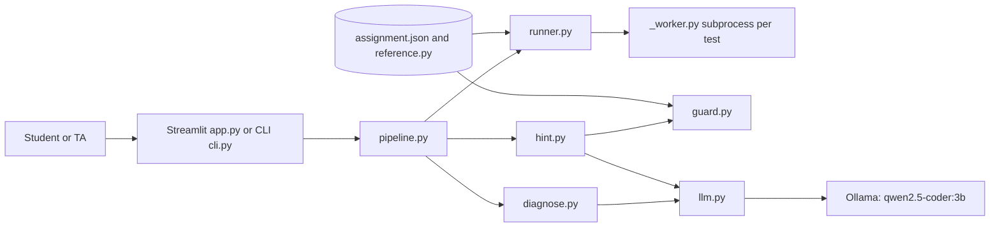
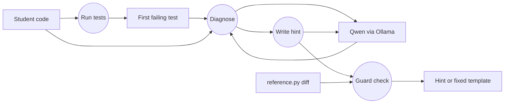
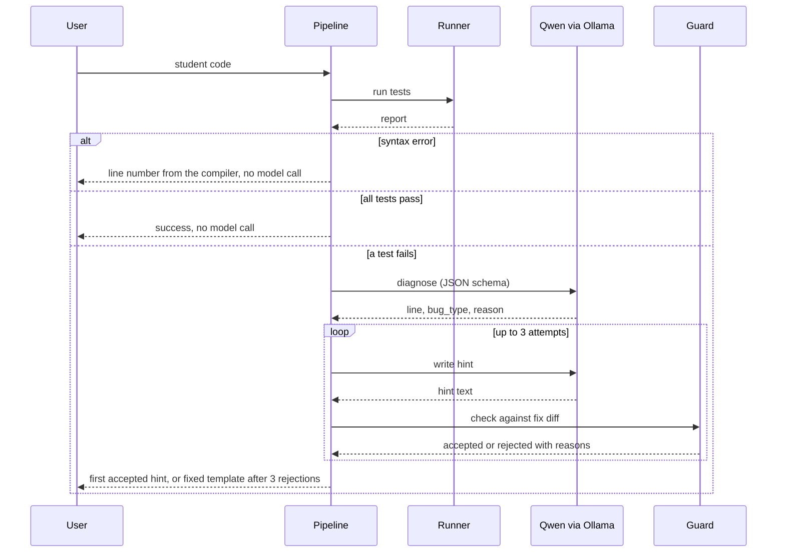

# Architecture

## System architecture

```mermaid
flowchart LR
    U[Student or TA] --> UI[Streamlit app.py or CLI cli.py]
    UI --> P[pipeline.py]
    P --> R[runner.py]
    R --> W[_worker.py subprocess per test]
    P --> D[diagnose.py]
    P --> H[hint.py]
    H --> G[guard.py]
    D --> L[llm.py]
    H --> L
    L --> O[Ollama: qwen2.5-coder:3b]
    A[(assignment.json and reference.py)] --> R
    A --> G
```

The model never sees `reference.py`. Only the guard reads it.

## Data flow

```mermaid
flowchart LR
    C[Student code] --> T((Run tests))
    T --> F[First failing test]
    F --> Q((Diagnose))
    C --> Q
    Q --> M[Qwen via Ollama]
    M --> Q
    Q --> Hn((Write hint))
    Hn --> M
    Hn --> Gd((Guard check))
    X[reference.py diff] --> Gd
    Gd --> Out[Hint or fixed template]
```

## Sequence with the guard loop

```mermaid
sequenceDiagram
    participant U as User
    participant P as Pipeline
    participant R as Runner
    participant M as Qwen via Ollama
    participant G as Guard
    U->>P: student code
    P->>R: run tests
    R-->>P: report
    alt syntax error
        P-->>U: line number from the compiler, no model call
    else all tests pass
        P-->>U: success, no model call
    else a test fails
        P->>M: diagnose (JSON schema)
        M-->>P: line, bug_type, reason
        loop up to 3 attempts
            P->>M: write hint
            M-->>P: hint text
            P->>G: check against fix diff
            G-->>P: accepted or rejected with reasons
        end
        P-->>U: first accepted hint, or fixed template after 3 rejections
    end
```
